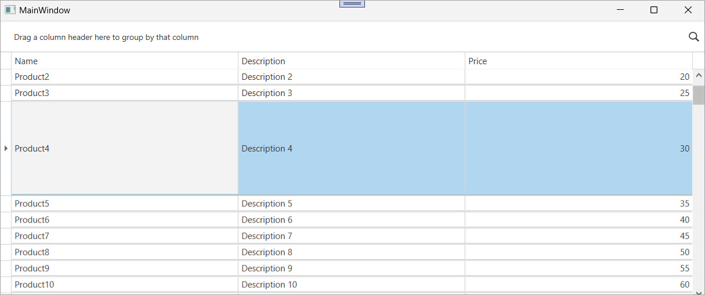

<!-- default badges list -->

[](https://supportcenter.devexpress.com/ticket/details/T157516)
[](https://docs.devexpress.com/GeneralInformation/403183)
[](#does-this-example-address-your-development-requirementsobjectives)
<!-- default badges end -->

# WPF Data Grid – Resize Row Height with a Splitter

This example configures the [`GridControl`](https://docs.devexpress.com/WPF/DevExpress.Xpf.Grid.GridControl) to resize row height with a splitter. The grid uses a custom control that stores row height in the [`RowData.RowState`](https://docs.devexpress.com/WPF/DevExpress.Xpf.Grid.RowData.RowState) property, so the height persists after refresh.



Use this technique when you need to:

* Allow users to resize rows manually.
* Persist row height after a user updates data or scrolls a view.
* Integrate a splitter into the row template.

## Implementation Details

1. Create a custom control that implements the `IResizeHelperOwner` interface.  
2. Add an attached `RowHeight` property to store the current height in the `RowState`.  
3. Define a `DataRowTemplate` for the view that includes the following:
   - A `ContentControl` bound to the [`DefaultDataRowTemplate`](https://docs.devexpress.com/WPF/DevExpress.Xpf.Grid.TableView.DefaultDataRowTemplate) to display the row content.
   - A custom `ResizableDataRow` control with a `RowSplitter` in its template.
4. Bind the `ContentControl.Height` property to the `RowHeight` property to apply size changes.

### Row Template

```xaml
<DataTemplate x:Key="PersistentRowStateDataRowTemplate">
    <StackPanel Orientation="Vertical">
        <dx:MeasurePixelSnapper>
            <Grid>
                <Grid.RowDefinitions>
                    <RowDefinition Height="*"/>
                    <RowDefinition Height="Auto"/>
                </Grid.RowDefinitions>
                <ContentControl Content="{Binding}"
                                ContentTemplate="{Binding Path=View.DefaultDataRowTemplate}"
                                Height="{Binding Path=RowState.(local:ResizableDataRow.RowHeight)}"/>
            </Grid>
        </dx:MeasurePixelSnapper>
        <local:ResizableDataRow>
            <local:ResizableDataRow.Template>
                <ControlTemplate>
                    <dxg:RowSplitter Name="PART_Resizer"
                                     Grid.Row="1"
                                     Cursor="SizeNS"
                                     Height="1" />
                </ControlTemplate>
            </local:ResizableDataRow.Template>
        </local:ResizableDataRow>
    </StackPanel>
</DataTemplate>
```

### Custom Control

The `ResizableDataRow` control implements the `IResizeHelperOwner` interface to work with `ResizeHelper`. The control stores the current row height in the `RowHeight` property and updates this value when the splitter moves.

```csharp
public class ResizableDataRow : Control, IResizeHelperOwner {
    public static readonly DependencyProperty RowHeightProperty =
        DependencyProperty.RegisterAttached("RowHeight", typeof(double), typeof(ResizableDataRow), new PropertyMetadata(20d));

    double IResizeHelperOwner.ActualSize { get => RowHeight; set => RowHeight = value; }
    void IResizeHelperOwner.ChangeSize(double delta) {
        RowHeight = Math.Min(300, Math.Max(20, RowHeight + delta));
    }
    // ...
}
```

## Files to Review

* [MainWindow.xaml](./CS/PersistentRowState/MainWindow.xaml) (VB: [MainWindow.xaml](./VB/PersistentRowState/MainWindow.xaml))
* [MainWindow.xaml.cs](./CS/PersistentRowState/MainWindow.xaml.cs) (VB: [MainWindow.xaml.vb](./VB/PersistentRowState/MainWindow.xaml.vb))
* [Classes.cs](./CS/PersistentRowState/Classes.cs) (VB: [Classes.vb](./VB/PersistentRowState/Classes.vb))
* [Data.cs](./CS/PersistentRowState/Data.cs) (VB: [Data.vb](./VB/PersistentRowState/Data.vb))

## Documentation

* [GridControl](https://docs.devexpress.com/WPF/DevExpress.Xpf.Grid.GridControl)
* [RowData](https://docs.devexpress.com/WPF/DevExpress.Xpf.Grid.RowData)
* [RowState](https://docs.devexpress.com/WPF/DevExpress.Xpf.Grid.RowData.RowState)
* [DataRowTemplate](https://docs.devexpress.com/WPF/DevExpress.Xpf.Grid.TableView.DataRowTemplate)
* [DefaultDataRowTemplate](https://docs.devexpress.com/WPF/DevExpress.Xpf.Grid.TableView.DefaultDataRowTemplate)

## More Examples

* [Implement CRUD Operations in the WPF Data Grid](https://github.com/DevExpress-Examples/wpf-data-grid-implement-crud-operations)
* [WPF Data Grid – Handle Drag and Drop Operations](https://github.com/DevExpress-Examples/wpf-grid-handle-drag-and-drop)
* [WPF Data Grid – Specify Custom Content for Column Chooser Headers](https://github.com/DevExpress-Examples/wpf-data-grid-custom-content-for-column-chooser-headers)
* [WPF Data Grid – Bind to Dynamic Data](https://github.com/DevExpress-Examples/wpf-bind-gridcontrol-to-dynamic-data)

<!-- feedback -->
## Does this example address your development requirements/objectives?

[](https://www.devexpress.com/support/examples/survey.xml?utm_source=github&utm_campaign=wpf-grid-resize-rows-using-splitter&~~~was_helpful=yes) [](https://www.devexpress.com/support/examples/survey.xml?utm_source=github&utm_campaign=wpf-grid-resize-rows-using-splitter&~~~was_helpful=no)

(you will be redirected to DevExpress.com to submit your response)
<!-- feedback end -->
